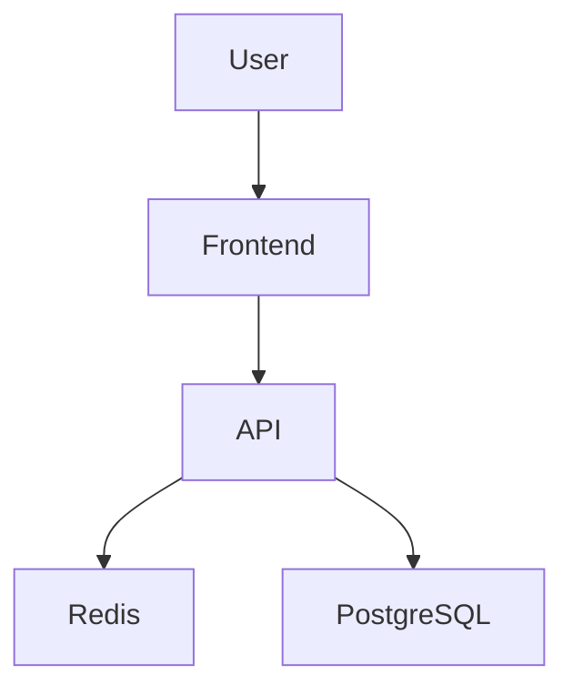

# AI Chatbot

A LLM powered Chatbot base on Spring Boot.The target includes scalable, highly available, and low-latency
chatbot system.

## Technology Stack

### Backend
- Kotlin
- Spring Boot

### Database
- PostgreSQL (planned)
- Redis (planned)

### AI / LLM
- Gemini API
- Vector Database (planned)

### Async Processing
- RabbitMQ (planned)

### Infrastructure
- Docker (planned)
- Docker Compose (planned)

### Observability
- Prometheus (planned)
- Grafana (planned)

### Testing
- JUnit 5
- MockK (planned)

### DevOps
- GitHub Actions (planned)

## System Architecture

## Getting Started

> Unix like:  
> ./gradlew bootRun  
>  windows:  
> ./gradlew.bat bootRun

## Roadmap

### Phase 1 — MVP
- REST API
- LLM integration
- PostgreSQL persistence
- Docker Compose setup

### Phase 2 — Streaming & Context Management
- Streaming response (SSE/WebSocket)
- Redis conversation context cache
- Session management

### Phase 3 — Async Processing
- BullMQ job queue
- Background task processing
- Retry / failure handling

### Phase 4 — RAG Pipeline
- Embedding generation
- Vector database integration
- Semantic retrieval

### Phase 5 — Monitoring & Optimization
- Metrics collection
- Structured logging
- Performance optimization
- Load testing

## Architecture Evolution

Monolith MVP
→ Stateful caching
→ Async processing
→ Retrieval pipeline
→ Production observability