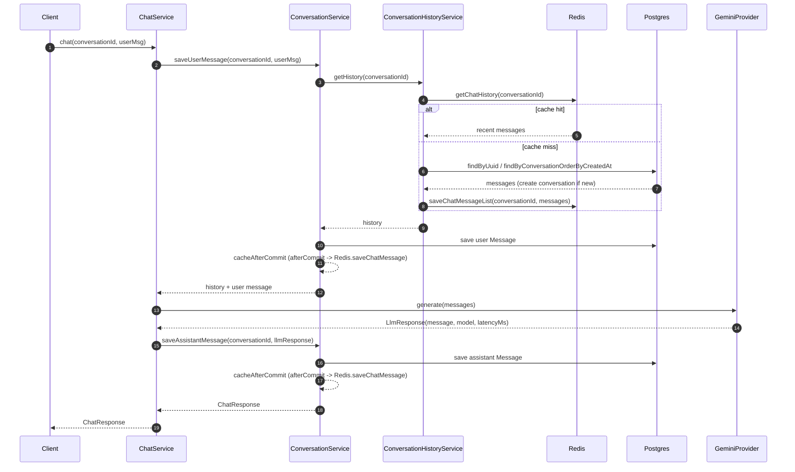

# Chat Flow

Sequence of a single `POST /chat` request, covering the Redis short-term
memory cache, the Postgres fallback, and the Gemini LLM call.

## Notes

- **Cache-aside read**: `ConversationHistoryService.getHistory` checks Redis
  first; on a miss it loads the most recent `app.conversation.cache.max-msg`
  messages from Postgres, creating the `Conversation` row if it doesn't exist
  yet, then backfills Redis so the next read is a hit.
- **Write-after-commit**: `ConversationService.saveMessage` persists to
  Postgres inside the `@Transactional` boundary, then registers a
  `TransactionSynchronization` so the Redis cache is only updated
  `afterCommit`. This avoids caching a message that gets rolled back.
- **Metrics**: `history.cache.time`, `history.db.fallback.time`, and
  `llm.generate.time` timers (tagged with cache hit/miss and Gemini
  outcome) are published via Micrometer/Prometheus for latency tracking.